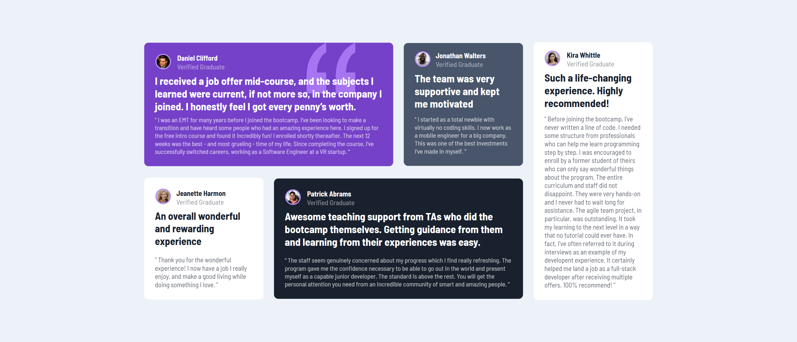

# frontend-mentor-Grid-challenge
A testimonial Grid challenge - Frontend mentor.
# Frontend Mentor - Testimonials grid section solution

This is a solution to the [Testimonials grid section challenge on Frontend Mentor](https://www.frontendmentor.io/challenges/testimonials-grid-section-Nnw6J7Un7). Frontend Mentor challenges help you improve your coding skills by building realistic projects. 

## Table of contents

- [Overview](#overview)
  - [The challenge](#the-challenge)
  - [Screenshot](#screenshot)
  - [Links](#links)
- [My process](#my-process)
  - [Built with](#built-with)
  - [What I learned](#what-i-learned)
  - [Continued development](#continued-development)
  - [Useful resources](#useful-resources)
- [Author](#author)
- [Acknowledgments](#acknowledgments)

## Overview

### The challenge

Users should be able to:

- View the optimal layout for the site depending on their device's screen size (375px and 1440px)

### Screenshot

### Links

- Live Site URL: (https://codex151.github.io/frontend-mentor-Grid-challenge/)

## My process

### Built with

- HTML
- CSS

### What I learned

This challenge helps learn more on CSS Grid properties.

### Continued development

I will focus on learning CSS frame work; bootstrap.

### Useful resources

- [Heroes World Institute of Technology online classes](herosworldtech@gmail.com) - My mentor record a video about how to make similar project and recomended that i take this challenge.
- [Youtube](https://youtu.be/68O6eOGAGqA) - This video help with a quick review of the necessary grid properties.

## Author

- GitHub - [codex151](https://github.com/codex151)
- Frontend Mentor - [codex151](https://www.frontendmentor.io/profile/yourusername)
- linkedin - [Muhammad Umar](https://www.linkedin.com/in/muhammad-umar-422709186?utm_source=share&utm_campaign=share_via&utm_content=profile&utm_medium=android_app)

## Acknowledgments

My sincere gratitude to my tutor David Onos who has been guiding me from the beginning of my journey.
Thanks a lot to Heroes World Institute of Technology. 
